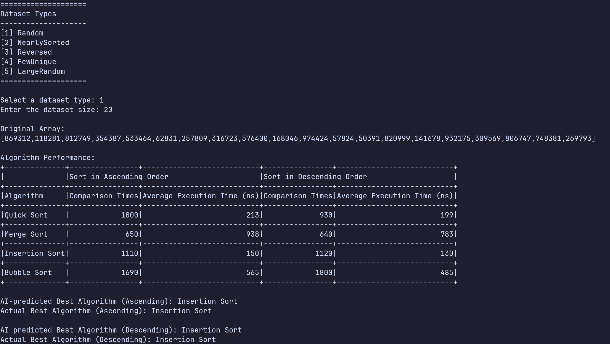

# Smart Sort

This repository stores the source code of **smart-sort**, including the core implementation with C++ and a machine-learning–based sorting model.

**Sample output:**

## Installation & Usage (Only Windows Currently)

View [Release Page](https://github.com/Fovir-GitHub/smart-sort/releases/latest) to download the zip file named `smart-sort-Windows-x64.zip` and unzip it. Then, click the executable file named `smart-sort.exe` to run the program.

## Reproduce

Please follow guides below based on your OS to reproduce this project.

- `Windows`: [`docs/reprduce-on-windows`](https://github.com/Fovir-GitHub/smart-sort/blob/main/docs/reproduce-on-windows.md)
- `NixOS`: [`docs/reproduce-on-nixos`](https://github.com/Fovir-GitHub/smart-sort/blob/main/docs/reproduce-on-nixos.md)

## Technology Stack

### Machine Learning

- `Python 3.12`: Implement the machine learning.
- `Poetry`: Ensure the reproducibility of machine learning module.

### Main Program

- `C++ 20`
- `CMake`: Build tool of the project.
- `Google Test`: Unit testing.
- `clang-format`: Check and correct the code format.
- `clang-tidy`: Check the code style.

### Misc

- `Git`: Version control.
- `pre-commit`: Run scripts before committing.
- `just`: Run scripts easier.

## Development

Follow the [CONTRIBUTING.md](https://github.com/Fovir-GitHub/smart-sort?tab=contributing-ov-file).
